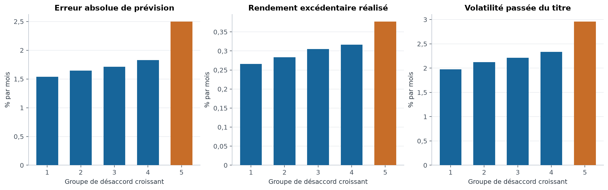
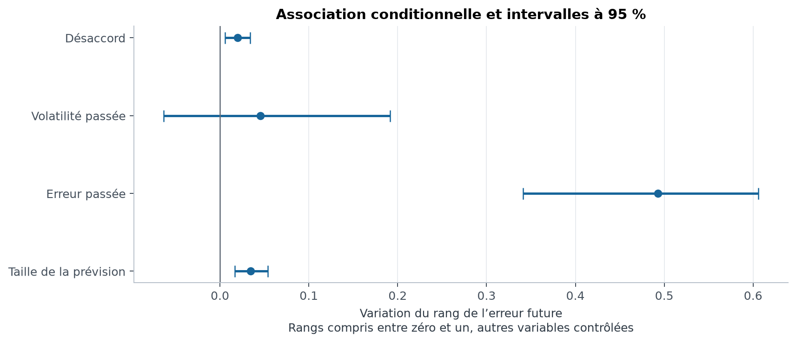
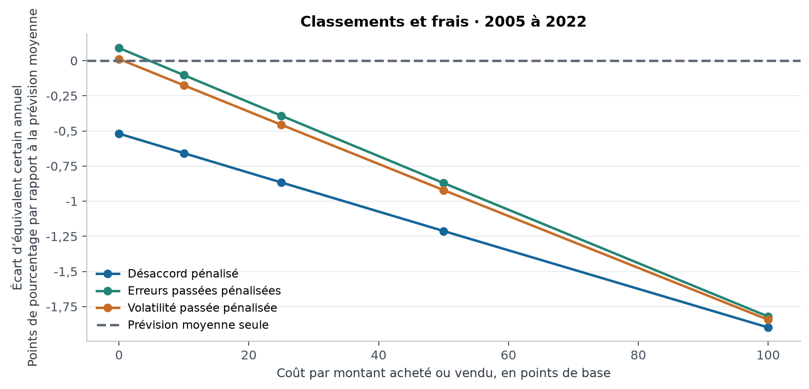
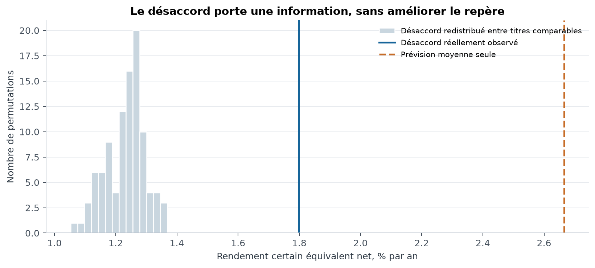

# Désaccord des modèles et choix d'obligations

Guillaume Vaudescal

Document de recherche, version 1.0 du 10 septembre 2026. Le protocole a été consigné dans le premier commit local avant le calcul des performances.

## Résumé

Cette étude demande si le désaccord entre prévisions améliore une sélection d'obligations. Elle utilise six modèles publiés par Dickerson, Nozawa et Robotti, sans les réentraîner.

Le désaccord est associé aux erreurs futures, même après contrôle des erreurs passées et de la volatilité. La pente conditionnelle vaut 0,020, sur des variables exprimées en rangs.

Ce résultat descriptif ne se traduit pas en avantage économique pour la règle étudiée. La règle pénalisant le désaccord présente un écart de rendement certain équivalent net de -0,87 point de pourcentage annuel.

L'intervalle apparié à 95 % est [-1,56, -0,13]. La règle pénalisée tourne davantage et perd déjà une partie de l'équivalent certain avant frais.

Un placebo suggère que le désaccord propre au titre contient une information. Le résultat demeure conditionnel au panneau publié, dont nous ne pouvons pas reconstruire les exclusions initiales.

## Abstract

This study uses six published bond return forecasts to distinguish model disagreement, historical forecast errors and return volatility. The models are not retrained.

Disagreement predicts future absolute forecast errors after historical controls. However, the prespecified disagreement-penalized portfolio underperforms the mean-forecast ranking in net certainty equivalent.

Conditional permutations preserve coarse forecast and volatility groups. Observed disagreement performs better than these permutations, while remaining below the mean-forecast benchmark. Findings are conditional on the released panel and hypothetical execution assumptions.

## 1. Une information sur l'erreur n'est pas nécessairement un signal de vente

Deux modèles peuvent prévoir des rendements proches et se tromper ensemble. Ils peuvent aussi prévoir des rendements différents, dont la moyenne reste utile. Leur dispersion et leur exactitude sont donc deux propriétés distinctes.

Les travaux de Bali, Kelly, Mörke et Rahman replacent le désaccord des prévisions parmi les variables étudiées en valorisation des actifs [1]. Notre expérience transpose cette question au marché obligataire.

La transposition reste limitée. Nous mesurons une dispersion entre familles d'algorithmes publiées par une autre équipe. Nous ne reproduisons pas la construction exacte de Bali et ses coauteurs.

Les obligations ajoutent une difficulté économique. Une sélection qui change souvent peut sembler intéressante avant frais et devenir coûteuse à réaliser. Dickerson, Nozawa et Robotti étudient notamment les délais de négociation [2].

Nous séparons donc deux questions. Le désaccord renseigne-t-il sur l'erreur à venir ? Et une règle qui le pénalise produit-elle un meilleur portefeuille, après les coûts retenus ?

Le protocole fixe les deux objets avant les résultats. Une association statistique favorable ne sera pas utilisée pour redéfinir ensuite le classement de portefeuille.

La contribution est cette séparation, accompagnée de contrôles comparables. Elle ne suppose ni nouveauté mondiale de l'idée, ni accès à des prix exécutables.

## 2. Les prévisions publiques rendent l'expérience possible

La source est l'archive d'Open Source Bond Asset Pricing publiée en avril 2026 [3]. Elle contient 29 787 291 lignes et 245 mois de signal, de juillet 2002 à novembre 2022.

Chaque ligne correspond à une obligation, une date de signal, une cible et un modèle. La date du rendement réalisé est celle de la fin du mois suivant.

La documentation associe déjà la prévision à sa cible future. Décaler encore le rendement créerait une erreur d'horizon. Le chargeur conserve donc cet appariement.

Les six modèles sont lasso, ridge, elastic net, réseau neuronal, arbres extrêmement aléatoires et forêt aléatoire. Trois ensembles supplémentaires sont fournis. Ils sont des moyennes et ne comptent pas comme trois opinions indépendantes.

Trois cibles sont disponibles. La cible principale, retxrf, est le rendement total de l'obligation au-delà du taux sans risque mensuel. Elle sert à la simulation des portefeuilles.

La cible retx est un rendement de crédit. La cible retd normalise ce rendement par une mesure combinant duration et écart de crédit. Ces deux cibles servent uniquement aux sensibilités descriptives.

La duration mesure la sensibilité du prix obligataire aux taux. L'écart de crédit mesure un supplément de rendement relativement à des titres du Trésor comparables. Leurs transformations ne constituent pas automatiquement le rendement d'un placement détenu.

## 3. L'audit vérifie le fichier, sans certifier l'univers initial

Le contrôle lit toutes les lignes. Les clés sont uniques, les dates du rendement suivent les dates de signal d'un mois et les valeurs sont finies.

Pour une même obligation et une même cible, tous les modèles doivent avoir le même rendement réalisé. Le programme vérifie cette identité. Il confronte aussi l'ensemble fourni à la moyenne arithmétique des six prévisions.

Le fichier ne contient aucune valeur manquante sur ces prévisions et rendements appariés. Cette propriété ne signifie pas que l'univers initial était complet. Elle peut résulter de filtres appliqués avant publication.

Nous ne disposons pas des observations exclues, des obligations dépourvues de rendement apparié ou du journal complet de préparation des caractéristiques. La portée de l'étude reste conditionnelle à ce panneau.

La chronologie des entraînements appartient également aux auteurs. Nos contrôles peuvent vérifier les dates du fichier et nos propres transformations. Ils ne peuvent pas reconstituer chaque décision de leur apprentissage.

Cette distinction empêche de présenter le résultat comme une preuve de performance négociable. Elle n'empêche pas d'étudier les relations entre prévisions, erreurs et classements dans les observations publiées.

L'archive reste hors de Git. Le dépôt conserve son adresse, sa taille et son empreinte SHA-256. Les droits de redistribution du panneau ne sont pas supposés à partir de son seul accès public.

## 4. Trois informations sont mesurées séparément

La prévision centrale est la moyenne des six modèles. Le désaccord est leur écart type, avec cinq degrés de liberté.

$$
\bar\mu_{i,t}=\frac{1}{6}\sum_{m=1}^{6}\hat\mu_{i,t}^{(m)},\qquad d_{i,t}=\sqrt{\frac{1}{5}\sum_{m=1}^{6}(\hat\mu_{i,t}^{(m)}-\bar\mu_{i,t})^2}
$$

Cette dispersion n'est pas un intervalle de confiance calibré. Les modèles partagent des données et ne sont pas indépendants. Un accord entre eux peut coexister avec un biais commun.

L'erreur passée est la moyenne des erreurs absolues de la prévision centrale pendant les douze mois précédents. La volatilité passée est l'écart type des rendements de ces mêmes mois.

Les fenêtres sont calendaires. Une obligation absente pendant plusieurs mois ne reçoit pas artificiellement les douze dernières lignes comme si elles représentaient une année continue.

Au moins six observations historiques sont nécessaires. Les méthodes partagent ensuite le même univers admissible. Sur la période testée, il comprend entre 2 740 et 5 584 obligations par mois.

Le calcul SQL s'arrête à la ligne dont le signal date du mois précédent. Le rendement associé à cette ligne est déjà connu à la date courante. La cible de la ligne actuelle reste exclue.

Le contrôle indépendant reconstruit une fenêtre à la main. Modifier les rendements futurs doit laisser les fenêtres précédentes inchangées. Ces propriétés sont vérifiées dans les tests.

## 5. Les règles gardent le même nombre de titres

La référence classe les obligations selon leur prévision moyenne. Elle retient les 20 % les mieux classées, avec des poids égaux.

La règle principale pénalise le désaccord à partir de rangs dans le mois. Le coefficient de pénalité vaut un demi et n'est pas optimisé.

$$
s_{i,t}=\operatorname{rang}_t(\bar\mu_{i,t})-\frac{1}{2}\operatorname{rang}_t(d_{i,t})
$$

Les rangs sont compris entre zéro et un. Les égalités reçoivent un rang moyen. La sélection finale conserve un ordre déterministe lorsque plusieurs scores sont égaux.

Deux contrôles remplacent le rang du désaccord par le rang de l'erreur passée ou de la volatilité passée. Tous utilisent la même pénalité et retiennent le même nombre d'obligations.

Un portefeuille supplémentaire conserve toutes les obligations admissibles. Il mesure ce que coûte la sélection relativement à cet univers de référence, sans prétendre représenter un indice obligataire officiel.

Le test principal porte sur les signaux de juillet 2005 à novembre 2022. Les rendements encaissés vont d'août 2005 à décembre 2022, soit 209 mois.

Cette fenêtre laisse une histoire avant le test pour construire les erreurs, la volatilité et le budget de risque. Elle n'est pas déplacée selon les performances obtenues.

## 6. Le risque et les frais sont comptés avant la comparaison

Chaque portefeuille sélectionné est combiné avec des liquidités. Sa part risquée dépend de sa volatilité historique sur vingt-quatre mois, avec au moins douze observations.

Le budget annuel vaut 6 %. La part risquée est plafonnée à un. Ce budget commun ne garantit pas que tous les portefeuilles auront la même volatilité réalisée.

La volatilité utilisée appartient au portefeuille théorique avant frais. Elle est calculée avant d'ajouter son rendement courant à l'histoire. La position ne connaît donc pas la variation qu'elle va encaisser.

Les rendements excédentaires sont reconvertis en rendements totaux avec le taux mensuel de French [4]. Ce taux sert également au placement en liquidités. Il constitue notre convention de financement.

Les coûts portent sur les achats et ventes d'obligations. Les poids dérivent avec les rendements totaux. Les frais sont financés avant l'encaissement du rendement suivant.

$$
k_t=1-c\sum_i|k_t w_{i,t}-b_{i,t}|
$$

Le poids avant échange est noté b, la cible après frais w et la richesse restante k. Seules les obligations sont facturées. La liquidité ferme le bilan.

Une obligation sortante est supposée vendue au dernier prix implicite connu. Sa vente est facturée. Nous ne supposons pas qu'un rendement manquant vaut zéro, mais la possibilité de cette liquidation reste hypothétique.

Les coûts sont fixés à zéro, dix, vingt-cinq, cinquante et cent points de base. Le scénario principal est vingt-cinq points de base par montant acheté ou vendu. Il n'est pas estimé depuis des transactions observées.

Les frais et les délais sont deux objets différents. Un coût proportionnel ne décrit pas l'impossibilité de trouver une contrepartie. Les données mensuelles fournies ne suffisent pas à reconstruire une exécution retardée de quelques jours.

## 7. Le désaccord prédit une partie de l'erreur

Les obligations sont réparties en cinq groupes de désaccord chaque mois. On calcule d'abord les moyennes de chaque groupe, puis leur moyenne temporelle. Les mois ne sont pas pondérés par leur nombre d'obligations.

L'erreur absolue moyenne passe de 1,54 % à 2,50 % par mois entre les groupes extrêmes. L'augmentation relative est de 62,2 %. La volatilité passée augmente également.

La comparaison brute ne sépare donc pas le désaccord de la volatilité. Une régression est estimée chaque mois pour examiner leur information conditionnelle.

La variable expliquée est le rang de l'erreur absolue future. Les variables explicatives sont les rangs du désaccord, de la volatilité passée, de l'erreur passée et de la prévision en valeur absolue.

$$
\operatorname{rang}_t(|r_{i,t+1}-\bar\mu_{i,t}|)=a_t+b_t\operatorname{rang}_t(d_{i,t})+\theta_t^{\top}C_{i,t}+u_{i,t+1}
$$

Le vecteur C rassemble les trois contrôles. La moyenne temporelle de b vaut 0,020. Son intervalle par blocs de douze mois est [0,006, 0,034].

Une pente positive indique une association supplémentaire entre désaccord et erreur. Elle ne mesure pas une causalité, et son échelle reste celle des rangs. Une hausse de rang de 0,1 est associée à une variation estimée dix fois plus petite que la pente affichée.

Les deux autres cibles sont présentées ci-dessous. Leur pente concerne une association d'erreur, sans création d'un portefeuille de richesse à partir de rendements transformés.

| Cible | Pente du désaccord | Borne basse | Borne haute |
| --- | --- | --- | --- |
| Rendement total excédentaire | 0,020 | 0,006 | 0,034 |
| Rendement de crédit | 0,043 | 0,025 | 0,058 |
| Crédit normalisé par duration et écart | 0,013 | 0,003 | 0,023 |

## 8. Pénaliser cette information ne produit pas un meilleur portefeuille

À coût principal, la référence rapporte 4,80 % par an. La règle pénalisant le désaccord rapporte 3,84 %. Les deux chiffres décrivent la croissance composée des placements simulés.

Le rendement certain équivalent retranche une pénalité de risque au rendement excédentaire moyen. Il vaut 2,67 % par an pour la référence, contre 1,80 % pour la règle pénalisée.

$$
CE_\gamma=12\bar r-6\gamma s_r^2,\qquad \gamma=5
$$

La différence principale vaut -0,87 point de pourcentage annuel. L'intervalle à 95 % est [-1,56, -0,13], avec une valeur p centrée de 0,0164.

| Classement | Rendement annuel (%) | Risque annuel (%) | Équivalent certain (% par an) | Rotation annuelle |
| --- | --- | --- | --- | --- |
| Prévision moyenne | 4,80 | 6,79 | 2,67 | 9,95 |
| Désaccord pénalisé | 3,84 | 6,56 | 1,80 | 11,34 |
| Erreurs passées pénalisées | 4,02 | 5,27 | 2,27 | 11,86 |
| Volatilité passée pénalisée | 3,96 | 5,31 | 2,21 | 11,80 |
| Toutes les obligations admissibles | 3,26 | 5,79 | 1,42 | 0,72 |

La rotation annuelle atteint 11,34 fois le capital pour la règle de désaccord. Elle vaut 9,95 pour la référence. Les achats et ventes sont tous deux comptés.

La détérioration ne vient pas seulement des frais. Avant coûts, l'écart d'équivalent certain vaut déjà -0,52 point de pourcentage annuel. Les frais amplifient ensuite cet écart.

Éviter une erreur importante peut retirer une obligation dont le rendement attendu rémunère justement davantage de risque. Le portefeuille peut aussi changer plus souvent de composition. Cette expérience ne permet pas d'attribuer une part causale exacte à ces deux mécanismes.

## 9. Le placebo distingue une information réelle d'une règle utile

Le placebo conserve la prévision centrale et la volatilité passée. Il croise leurs quintiles pour former des groupes de titres comparables dans chaque mois.

Le désaccord est ensuite redistribué au hasard à l'intérieur de ces groupes. La règle de classement, le nombre de titres et le traitement des frais restent identiques.

Les 99 permutations sont déterminées par des graines fixées. Leur équivalent certain médian vaut 1,24 % par an. 99 sont inférieures à la règle utilisant le désaccord effectivement observé.

La règle réelle reste pourtant inférieure à la référence sans pénalité. Le désaccord contient donc une information propre au titre qui ne justifie pas, à elle seule, le coefficient de pénalité étudié.

L'échangeabilité des obligations à l'intérieur des groupes demeure une hypothèse. Le placebo est donc un diagnostic descriptif. Il n'identifie ni croyances humaines ni mécanisme causal de prix.

## 10. La conclusion résiste aux blocs, pas à toutes les limites de données

Les intervalles de la comparaison principale restent négatifs pour les trois longueurs de blocs prévues. Leur largeur varie avec l'hypothèse de dépendance temporelle.

| Bloc en mois | Écart annuel | Borne basse à 95 % | Borne haute à 95 % |
| --- | --- | --- | --- |
| 6 | -0,87 | -1,62 | -0,07 |
| 12 | -0,87 | -1,56 | -0,13 |
| 24 | -0,87 | -1,50 | -0,26 |

Ces intervalles déplacent les mêmes mois pour les deux stratégies. Un rééchantillonnage indépendant des obligations aurait ignoré une partie des chocs communs de marché.

Un diagnostic supplémentaire de sélection emploie huit blocs disjoints. La proportion de classements sous la médiane hors de la moitié choisie vaut 35,7 %. Les fichiers conservent aussi une sensibilité du Sharpe dégonflé [5, 6].

Ces diagnostics sont postérieurs au calcul des chemins et restent descriptifs. Ils ne remplacent ni le test principal fixé, ni une vérification des données initiales non fournies.

L'objection la plus forte porte sur l'univers publié. Si la présence dans le fichier dépend d'un rendement futur observable, les portefeuilles héritent de cette sélection. Nos tests ne peuvent pas éliminer une sélection dont les observations exclues manquent.

Une autre pénalité pourrait produire un classement différent. Elle ne serait pas une confirmation de ce protocole si elle était choisie après lecture du test. Elle demanderait une nouvelle comparaison et de nouvelles données.

## Conclusion

Le désaccord entre modèles renseigne sur une partie de leurs erreurs futures. Dans la règle fixée ici, le pénaliser réduit néanmoins la performance économique nette.

La distinction entre information et décision est le résultat utile. Le placebo suggère une information propre au titre, tandis que la référence montre son insuffisance pour améliorer cette sélection.

Une extension crédible demanderait les observations avant filtrage et des données de transaction permettant de mesurer la réalisation des positions. Le fichier mensuel actuel ne fournit pas ces deux éléments.

## Reproductibilité et statut des affirmations

L'archive et les calculs propres au dépôt sont mesurés. Les frais, les liquidations et le placement en liquidités suivent des conventions modélisées. Les travaux de la littérature sont rapportés avec leurs références.

Le SQL, les tests, toutes les variantes prévues et les résultats mensuels des portefeuilles sont disponibles. Les données individuelles brutes restent locales. Le PDF est produit depuis cet article.

L'assistance d'IA a servi au code et à la rédaction. Les contrôles indépendants sont documentés. Le document n'a pas été évalué par les pairs.

## Références

[1] Bali, T. G., Kelly, B., Mörke, M. et Rahman, J. 2026. Machine Forecast Disagreement. Review of Financial Studies. [DOI](https://doi.org/10.1093/rfs/hhag042).

[2] Dickerson, A., Nozawa, Y. et Robotti, C. 2025. Factor Investing with Delays. Document de travail du 23 juillet. [Texte universitaire](https://www.ier.hit-u.ac.jp/Common/publication/DP/DPS-A771.pdf).

[3] Open Source Bond Asset Pricing. Archive des prévisions, avril 2026. [Fichiers et documentation](https://openbondassetpricing.com/machine-learning-data/).

[4] French, K. Research Data Factors. [Données et conventions](https://mba.tuck.dartmouth.edu/pages/faculty/ken.french/data_library.html).

[5] Bailey, D., Borwein, J., López de Prado, M. et Zhu, Q. 2017. The Probability of Backtest Overfitting. Journal of Computational Finance 20. [DOI](https://doi.org/10.21314/JCF.2016.322).

[6] Bailey, D. et López de Prado, M. 2014. The Deflated Sharpe Ratio. Journal of Portfolio Management 40, 94 à 107. [DOI](https://doi.org/10.3905/jpm.2014.40.5.094).
